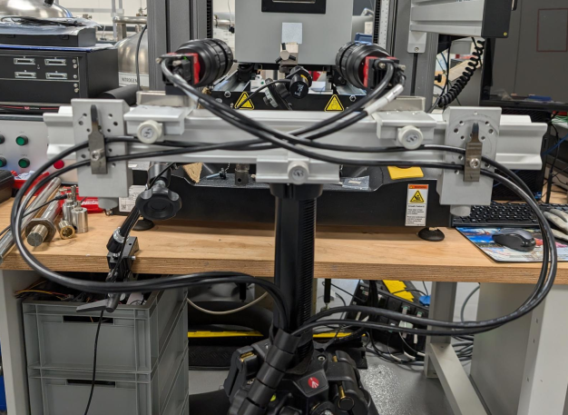

# Long Term Stability of Stereo Calibration for Creep Applications

The stability of a stereo setup over long durations is fundamentally important for making accurate measurements of creep deformation. 

## The Challenge
If the spatial relationship between the cameras changes, i.e. any of the extrinsic parameters of the calibration change over time, then error is introduced to the measurement. Of particular importance is the stereo angle. Changing the stereo angle introduces spurious out-of-plane movement and biaxial strains. The magnitude of changes to the spatial relationship can be small, but cause strains greater than those expected due to elastic loading. Often, the calibration is still 'valid' i.e. the images can still be correlated. Increases to the epipolar distance can be an indicator that this is occurring.

## Setup for Creep DIC
For DIC experimental setups it is often preferable to have a flexible setup, with multiple degrees of freedom. For example, optical rails with 3-axis rotation heads. However, over long durations, these have a tendency to sag or slowly move, causing the spatial relationship between the cameras to drift from where it was calibrated. Further, camera cabling can slowly move cameras, either via their own mass or by acting like a spring.

Given this, the following suggestions are made for long term DIC setup stability:

- Reduce degrees of freedom for camera mounts. Directly mounting cameras to optical rail carriages for example.
- No not use 'soft' couplings. i.e. set screws with rubber pads, soft washers, or padded mounts.
- Provide adequate cable stress relief. Eliminate the mass of the cable or any spring effect.
- Always include a 'dummy' specimen in the test field of view. This is an unloaded piece of material that can be used to assess if setup drift has occurred. 

An example of this kind of setup is shown here:

